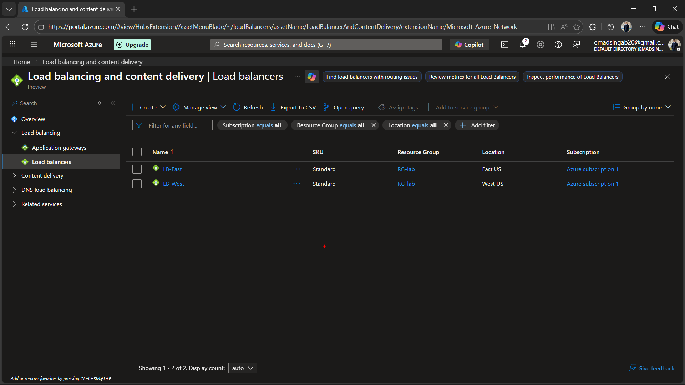

# 4. Deploy and Configure Load Balancers ⚖️

## 🎯 Section Goal
Deploy two fully functional public Azure Load Balancers (one in West US, one in East US) to ensure seamless traffic distribution across virtual machines. These load balancers will serve as the primary regional endpoints for an Azure Traffic Manager profile in the final phases of this project.

---

## 📚 Theoretical Concept & Learning Objectives
Azure Load Balancers operate at Layer 4 (TCP/UDP) to distribute incoming traffic among healthy virtual machine instances. 
- **High Availability:** Prevents overloading of any single VM and ensures continuous application availability in case of individual instance failures.
- **Health Probes:** Continuously monitors the health of backend instances (e.g., checking HTTP port 80). Traffic is instantly halted to any instance that fails the health check.
- **Strategic Placement:** Deploying load balancers regionally prepares the infrastructure for global traffic routing using Azure Traffic Manager.

---

## 🚀 Task 1: Deploy `LB-West` (West US Region)

**Implementation Steps:**

1. **Initiate Deployment:** Searched for **Load balancers** in the Azure Portal to begin the deployment.
   

2. **Select Standard Load Balancer:** Clicked **+ Create** and chose the Standard Load Balancer option to distribute traffic to backend resources.
   

3. **Configure Basics:** Created a new Regional Public Load Balancer named `LB-West` within the `RG-lab` resource group in the `West US` region, using the Standard SKU.
   

4. **Frontend IP Configuration:** Created a new public IP address (`FE-LBWese`) to serve as the internet-facing entry point for regional traffic.
   

5. **Backend Pool Setup:** Configured a backend pool named `BE-pool` and associated it with the `vNet-West` virtual network. This pool will later host the regional virtual machines.
   

6. **Inbound Rules & Health Probes:** Created an HTTP health probe (`http-check`) monitoring port 80 with a 4-second interval. Defined a Load Balancing Rule to forward TCP traffic arriving on frontend port 80 to backend port 80.
   

7. **Review and Create:** Validated all configurations successfully and clicked **Create** to provision `LB-West`.
   

---

## 🚀 Task 2: Deploy `LB-East` (East US Region)

**Implementation Steps:**

1. **Configure Basics for East Region:** Provisioned the second Standard Public Load Balancer named `LB-East` in the `East US` region within `RG-lab` for multi-region redundancy.
   

2. **Frontend IP Configuration:** Assigned a new dedicated public IP (`FE-IP`) for the East region traffic.
   

3. **Backend Pool Setup:** Created `BB-Pool` and linked it directly to the `vNet-East` virtual network.
   

4. **Inbound Rules & Health Probes:** Mirrored the West region configuration by establishing an HTTP health probe (`HTTP-check`) and a TCP port 80 load balancing rule to ensure consistent traffic handling across both geographical sites.
   

5. **Review and Create:** Validated the East Load Balancer configuration and initiated the deployment.
   

---

## ✅ Final Verification

Successfully validated that both `LB-West` and `LB-East` are fully provisioned, active, and listed in the Azure Load Balancers dashboard, ready to route traffic to the upcoming compute resources.

---
*✅ Phase 4 Completed Successfully!*