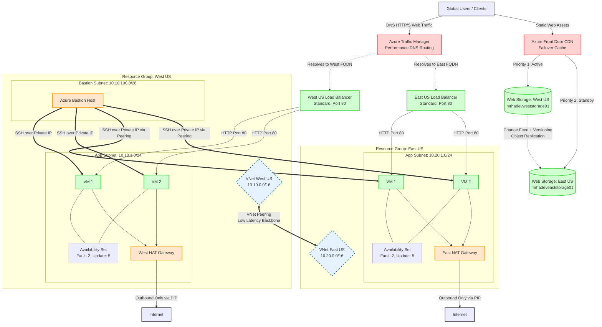

# Azure Multi-Region Highly-Available Infrastructure (Terraform)

This folder contains the complete **Infrastructure as Code (IaC)** configuration using Terraform to deploy a highly-available, secure, cost-optimized, and resilient multi-region infrastructure on Microsoft Azure.

---

## Architecture Relation & Traffic Flow

The following diagram illustrates how the components and Terraform modules relate to each other, how external traffic is handled, and how secure administrative connectivity is configured.



---

## Directory Structure

Below is the directory structure of the Terraform folder detailing the purpose of each file and module:

```
Terraform/
├── backend/                  # Bootstrapping code for remote state
│   ├── main.tf               # Creates Storage Account & Blob Container for state
│   ├── variables.tf          # Configures backend variables (rg, storage account name, etc.)
│   ├── terraform.tfvars      # Local variable overrides for the backend storage setup
│   └── output.tf             # Outputs connection details for remote state storage
│
├── main/                     # Primary environment deployment (composition root)
│   ├── main.tf               # Combines & coordinates all custom modules
│   ├── provider.tf           # Terraform & Azure Provider declarations (+ backend config)
│   ├── variables.tf          # Environment level variables (VM sizes, region specifications, etc.)
│   ├── terraform.example.tfvars  # Reference variables file for deployment
│   └── outputs.tf            # Key system endpoints (TM FQDN, VM IPs, CDN Hostnames, etc.)
│
└── modules/                  # Reusable local infrastructure modules
    ├── resource-group/       # Custom module for resource groups
    ├── network/              # Virtual Networks (VNet) & subnets setup
    ├── nat-gateway/          # Secure outbound NAT Gateways per region
    ├── Bastion/              # Bastion Host configuration for secure shell access
    ├── compute/              # Linux VM Scale-equivalents (Availability Sets + cloud-init nginx)
    ├── load-balancer/        # Layer-4 Regional Standard Public Load Balancer
    ├── traffic-manager/      # DNS-based global traffic routing
    ├── lb_traffic_manager/   # Composite module tying TM to regional Load Balancers
    ├── vnet-peering/         # Bi-directional virtual network peering configuration
    └── storage_static/       # Active/Passive static web storage behind Front Door (CDN)
```

---

## Modules Breakdown

Each directory inside `modules/` is structured to encapsulate a single, logical domain of Azure infrastructure, exposing clean interfaces (variables) and returning identifiers (outputs) used by other modules.

| Module | Description | Resources Created |
| :--- | :--- | :--- |
| **`resource-group`** | Standardizes Resource Group resource configurations across environments. | `azurerm_resource_group` |
| **`network`** | Deploys VNets and custom Subnets based on address prefixes dynamically passed in. | `azurerm_virtual_network`, `azurerm_subnet` |
| **`nat-gateway`** | Provisions a public IP, NAT Gateway, and binds them to a target subnet to enable zero-public-IP VMs to safely pull updates outbound. | `azurerm_public_ip`, `azurerm_nat_gateway`, `azurerm_nat_gateway_public_ip_association`, `azurerm_subnet_nat_gateway_association` |
| **`Bastion`** | Provisions a standard secure gateway to enable administrative SSH access using VM private IPs. Deployed only in the primary region (`westus`) to optimize cost. | `azurerm_public_ip`, `azurerm_bastion_host` |
| **`compute`** | Creates Ubuntu 22.04 LTS VMs inside an Availability Set (fault/update domains). Uses `cloud-init.yaml` to bootstrap Nginx with custom region indicators. | `azurerm_availability_set`, `azurerm_network_interface`, `azurerm_network_interface_backend_address_pool_association`, `azurerm_linux_virtual_machine` |
| **`load-balancer`** | Deploys a standard Layer-4 load balancer with a static public IP and configured HTTP health probe on port 80. | `azurerm_public_ip`, `azurerm_lb`, `azurerm_lb_backend_address_pool`, `azurerm_lb_probe`, `azurerm_lb_rule` |
| **`traffic-manager`** | Configures global DNS routing rules using the Microsoft routing backbone to handle multi-region endpoint distribution. | `azurerm_traffic_manager_profile`, `azurerm_traffic_manager_external_endpoint` |
| **`lb_traffic_manager`** | A high-level orchestration module that spins up Load Balancers per-region and registers them dynamically as external endpoints under Traffic Manager. | *Combines load-balancer & traffic-manager modules* |
| **`vnet-peering`** | Configures bidirectional low-latency peering connection between West US and East US VNets, enabling the Bastion in West US to connect directly to VMs in East US. | `azurerm_virtual_network_peering` (x2) |
| **`storage_static`** | Standard Web Storage accounts (LRS) configured for hosting static websites behind a global Azure Front Door (CDN) endpoint with health-probe routing and regional failover. | `azurerm_storage_account`, `azurerm_storage_container`, `azurerm_cdn_frontdoor_profile`, `azurerm_cdn_frontdoor_endpoint`, `azurerm_cdn_frontdoor_origin_group`, `azurerm_cdn_frontdoor_origin`, `azurerm_cdn_frontdoor_route` |

---

## Deployment Runbook

Follow these steps to deploy this infrastructure from scratch:

### Step 1: Bootstrap the Remote State Backend
Before provisioning the main architecture, create the storage resources that will store Terraform's state file:
1. Navigate to the backend directory:
   ```bash
   cd Terraform/backend
   ```
2. Review and configure your values in `terraform.tfvars`.
3. Initialize and apply:
   ```bash
   terraform init
   terraform apply
   ```
4. Record the storage account name and access keys output by the execution.

### Step 2: Configure the Backend Provider block
Once the remote backend resources are successfully deployed:
1. Navigate to the main directory:
   ```bash
   cd ../main
   ```
2. Open `provider.tf` and uncomment the `backend "azurerm"` block (lines 11-16):
   ```hcl
   backend "azurerm" {
     resource_group_name  = "tfstate-rg"            # Replace with backend output
     storage_account_name = "emadtfstate001"        # Replace with backend output
     container_name       = "tfstate"
     key                  = "dev.terraform.tfstate"
   }
   ```
3. Copy the reference variable file `terraform.example.tfvars` to `terraform.tfvars`:
   ```bash
   cp terraform.example.tfvars terraform.tfvars
   ```
4. Fill in the required variables, particularly `subscription_id` and your `admin_ssh_public_key`.

### Step 3: Initialize & Deploy the Main Architecture
1. Re-initialize Terraform in the `main` directory to migrate state to Azure:
   ```bash
   terraform init
   ```
2. Validate the configuration:
   ```bash
   terraform validate
   ```
3. Generate and verify the execution plan:
   ```bash
   terraform plan -out=tfplan
   ```
4. Apply the configuration to provision the architecture:
   ```bash
   terraform apply tfplan
   ```

---

## Input Variables Reference

The primary environment variables defined in [`main/variables.tf`](file:///home/emad/Data/VAGRANT-VMS/deleteme-azure/azure-multi-region-highly-available-infrastructure/Terraform/main/variables.tf):

| Variable | Type | Default | Description |
| :--- | :--- | :--- | :--- |
| `subscription_id` | `string` | *Required* | Azure subscription ID |
| `project_name` | `string` | `"multi-region-ha"` | Base identifier for naming resources |
| `environment` | `string` | `"dev"` | Deployment stage (`dev`, `test`, `prod`) |
| `admin_username` | `string` | `"azureuser"` | Administrative user credentials for Virtual Machines |
| `admin_ssh_public_key`| `string` | *Required* | Public SSH key utilized for remote authentication via Bastion |
| `vm_size` | `string` | `"Standard_B1s"` | Azure size tier for VMs |
| `vm_count_per_region` | | `2` | Number of VM nodes in each region (Minimum: `2` for high availability) |

---

## Output Variables Reference

The core outputs returned by [`main/outputs.tf`](file:///home/emad/Data/VAGRANT-VMS/deleteme-azure/azure-multi-region-highly-available-infrastructure/Terraform/main/outputs.tf):

| Output | Description |
| :--- | :--- |
| `traffic_manager_fqdn` | The global domain name created by Traffic Manager. Routing to this address will balance between regions. |
| `frontdoor_hostname` | Hostname endpoint generated for the static storage CDNs. |
| `bastion_public_ip` | Public IP utilized to initiate secure remote SSH tunnel mappings. |
| `vm_private_ips` | List of VMs private network interface IPs segmented by region. |
| `load_balancer_public_fqdns` | FQDN mappings for the individual regional load balancers. |
| `resource_group_names` | The names of the generated Azure Resource Groups. |

---

## Key Design Decisions Implemented in Code

1. **Zero Public IPs on VMs**: Under [`modules/compute/main.tf`](file:///home/emad/Data/VAGRANT-VMS/deleteme-azure/azure-multi-region-highly-available-infrastructure/Terraform/modules/compute/main.tf), we set VM configurations with private interfaces only. No public IPs are provisioned, safeguarding the compute cluster from external scanning.
2. **Cost-Optimized Admin Model**: Rather than provisioning separate Azure Bastion Hosts in every region, a single Bastion Host is deployed in `westus`. Private traffic is routed securely to the `eastus` network via bidirectional Virtual Network Peering in [`modules/vnet-peering/main.tf`](file:///home/emad/Data/VAGRANT-VMS/deleteme-azure/azure-multi-region-highly-available-infrastructure/Terraform/modules/vnet-peering/main.tf).
3. **Secure Internet Outbound**: Standard private-subnets lack outbound routing. By coupling an [`azurerm_nat_gateway`](file:///home/emad/Data/VAGRANT-VMS/deleteme-azure/azure-multi-region-highly-available-infrastructure/Terraform/modules/nat-gateway/main.tf) to each app subnet, VMs download updates using stateful outbound NAT without exposing any inbound ports.
4. **Availability Sets**: Compute instances are wrapped in Availability Sets. In the event of localized failure domains experiencing downtime, Azure isolates compute nodes across separate physical racks.
